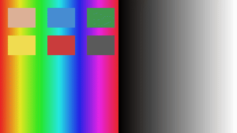

# liangzai-cube-kit

liangzai-cube-kit 是一个开源的 **Adobe `.cube` LUT** 工具：解析标准 **3D LUT 颜色查找表**，用 **三线性插值** 套 LUT，适合「LUT 怎么用、批量套 LUT、滤镜预览」这类调色零件。一行命令看前后对比，一行代码读表、混合、写回。

本仓库只开 **通用标准技术**（`.cube` 读写、插值、教科书级曝光 / 色温），不含美颜模型、不含产品风格配方。完整桌面修图产品见 [云享传靓仔总览](https://github.com/18818474455/liangzai)。

[](https://www.npmjs.com/package/liangzai-cube-kit)
[](./LICENSE)
[](https://github.com/18818474455/liangzai-cube-kit/actions/workflows/ci.yml)

[在线试跑](https://18818474455.github.io/liangzai-cube-kit/) · [npm](https://www.npmjs.com/package/liangzai-cube-kit) · [产品总览](https://github.com/18818474455/liangzai)



## Quick Start

```bash
npm install liangzai-cube-kit
```

```ts
import { parseCube, applyCubeToRgba8 } from 'liangzai-cube-kit'

const pixels = applyCubeToRgba8(parseCube(cubeText), rgba8, 0.8)
```

```bash
npm start
```

会写出 `out/input.png` 和 `out/output.png`。上面的 GIF 就是这组色条套暖调演示格的结果。

想顺手改曝光 / 色温（教科书公式，不是产品 RAW 白平衡）：

```ts
import { applyBasicGradeToRgba8 } from 'liangzai-cube-kit'

const graded = applyBasicGradeToRgba8(rgba8, { ev: 0.3, kelvin: 5200 })
```

## 这个库解决什么

| 你在找 | 这里有 |
|--------|--------|
| `.cube LUT` 怎么读、怎么写 | `parseCube` / `stringifyCube` |
| `3D LUT 颜色查找表` 怎么套到像素 | `applyCubeToRgba8`（三线性插值 + 强度混合） |
| `批量套 LUT` / 滤镜预览 | CLI `npm start`，或自己循环读图 |
| `开源调色库` 里能直接 import 的零件 | npm：`liangzai-cube-kit` |

混合公式：`out = in + (lut(in) − in) × t`。演示格是标准暖调，不是产品成片 LUT。

## 功能

- 读 Adobe `.cube` 3D LUT（红 → 绿 → 蓝）
- 三线性插值 + 强度混合
- 序列化回 `.cube`；另有 1D LUT
- 教科书级曝光（`rgb × 2^ev`）与 Kelvin 色温增益
- 浏览器 playground：拖图、拖强度，不用装桌面软件

## Playground

https://18818474455.github.io/liangzai-cube-kit/

## 相关仓库

| 仓库 | 说明 |
|------|------|
| [liangzai](https://github.com/18818474455/liangzai) | 产品总览 + 技术架构 + 开闭源声明 |
| [liangzai-plugin-sdk](https://github.com/18818474455/liangzai-plugin-sdk) | 插件类型与 Hello 示例（正式 App 不加载） |
| [liangzai-cube-kit](https://github.com/18818474455/liangzai-cube-kit) | 本仓库 |

现场桌面修图怎么打包、签名、把像素留在本机：[shipping-a-desktop-retoucher.md](docs/shipping-a-desktop-retoucher.md)

## License

MIT © 长沙粤北偏北传媒有限公司

产品试用与合作见总览仓底部联系方式，或官网 [ybpbyxc.com](https://www.ybpbyxc.com)
