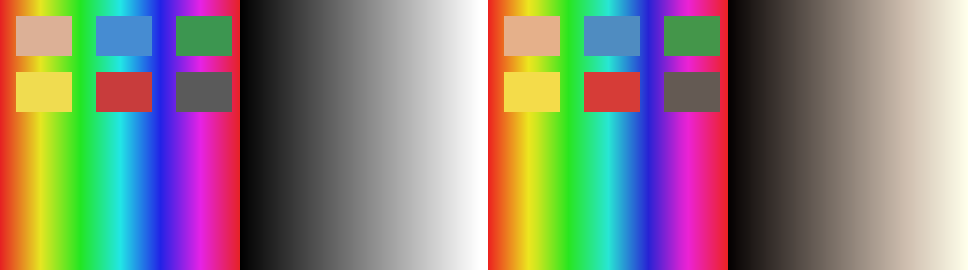

# liangzai-cube-kit

[](https://github.com/18818474455/liangzai-cube-kit/actions/workflows/ci.yml)
[](https://www.npmjs.com/package/liangzai-cube-kit)
[](./LICENSE)

从云享传靓仔管线中抽出的标准 `.cube` 工具，MIT 授权。

解析 Adobe 3D / 1D LUT，并提供教科书级曝光（`rgb × 2^ev`）与色温（Kelvin → RGB 增益）。零运行时依赖，可直接 `import`。



## Install

```bash
npm install liangzai-cube-kit
```

```ts
import {
  parseCube,
  applyCubeToRgba8,
  applyBasicGradeToRgba8,
  cubeMetadata
} from 'liangzai-cube-kit'

const graded = applyBasicGradeToRgba8(rgba8, { ev: 0.3, kelvin: 5200 })
const cube = parseCube(cubeText)
const pixels = applyCubeToRgba8(cube, graded, 0.8)
console.log(cubeMetadata(cube))
```

## API

| 函数 | 作用 |
|------|------|
| `parseCube` / `stringifyCube` | 3D `.cube` |
| `parseCube1D` / `stringifyCube1D` | 1D `.cube` |
| `sampleCube` / `mixSample` | 单像素采样与强度混合 |
| `applyCubeToRgba8` | 整帧 RGBA8 |
| `cubeMetadata` | 导出 title / size / domain / 点数 |
| `identityCube` / `warmDemoCube` | 测试与演示格 |
| `applyExposure` / `applyColorTemperature` | 单像素 EV / Kelvin |
| `applyBasicGradeToRgba8` | 整帧曝光 + 色温 |

超出 domain 的采样钳到端点；`intensity` 超出 0–1 时钳制。

## Demo

```bash
npm install
npm test
npm start -- --ev 0.3 --kelvin 5200
```

浏览器演示：`npm run build` 后用静态服务器打开 `docs/demo.html`。

我们怎么把现场修图做成桌面软件： [docs/shipping-a-desktop-retoucher.md](docs/shipping-a-desktop-retoucher.md)

## License

MIT © 长沙粤北偏北传媒有限公司

产品与合作：微信 `cylbaw` · [ybpbyxc.com](https://www.ybpbyxc.com)
